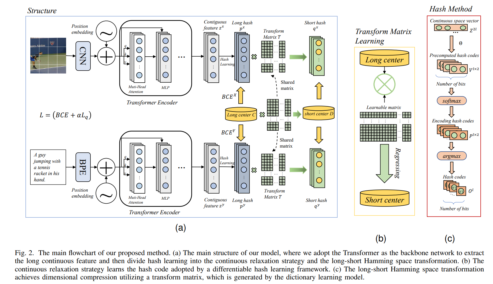
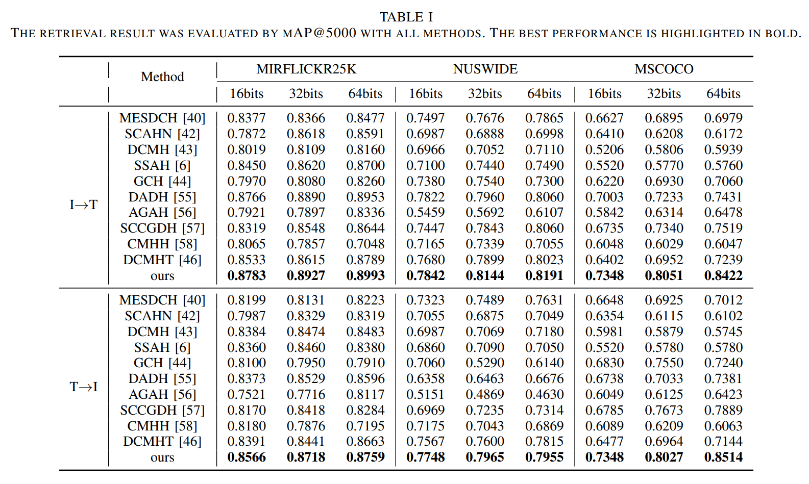

# TwDH
This is the official code for paper of "Two-Step Discrete Hashing for Cross-Modal Retrieval", [paper](https://ieeexplore.ieee.org/document/10487033)

[paper] just has been accepted by TMM, paper will be published soon!

# Introduction

Previous cross-modal hashing approaches ignore the information loss problem in the quantization and dimension reduction process, we propose a novel two-step hashing method to mitigate this issue. Specifically, we first design a novel discrete strategy, which utilizes a smooth hash module to generate the hash code for differentiable training. Second, we design a novel long-short Hamming space transformation module to effectively preserve the dimensional information before the long-short code projection. In summary, this two-step method could reduce information loss, thereby improving the retrieval performance.

## Framework

In this work, we propose a novel two-step discrete hashing, which first extracts a long hash code and second utilizes a transform matrix T to project the long hash code to the short one. The projection procedure is shown in (b). The quantization method we inherit from the [DCMHT](https://github.com/kalenforn/DCHMT/tree/main) method. 

## Results


## Intorduction for the Transform matrix
The Transform matrix T is generagted by a simple model, which is shown in "transform_matrix_generation" floder. We provide this matrix in project (PROJECT_ROOT/data/transformer/TwDH) while you can train a model to generate this parameter. The training step is:

> cd ./transform_matrix_generation
>
> ln -s ../../../models/common/optimizer.py .
>
> ln -s ../../../dataset .
>
> python train.py --dataset flickr25k --save-dir ./data/flickr25k/ --batch-size 200 --long-dim 512 --output-dim 16 --index-file ../../../data/transformer/flickr/index.mat --caption-file ../../../data/transformer/flickr/caption.mat --label-file ../../../data/transformer/flickr/label.mat --post-lr 0.1 --long-center-path ../../../data/transformer/TwDH/coco/long/512.pkl --short-center-path ../../../data/transformer/TwDH/coco/short/16.pkl

The hash center in this part is the same as [CSQ](https://github.com/yuanli2333/Hadamard-Matrix-for-hashing), this center is also provided in PROJECT_ROOT/data/transformer/TwDH.


## Training
>cd ../../
>
> python main.py --config-file configs/TwDH/config.yaml--save-dir result/TwDH/coco/16

## Citation

```@ARTICLE{10487033,
  author={Tu, Junfeng and Liu, Xueliang and Hao, Yanbin and Hong, Richang and Wang, Meng},
  journal={IEEE Transactions on Multimedia}, 
  title={Two-Step Discrete Hashing for Cross-Modal Retrieval}, 
  year={2024},
  pages={1-12},
  doi={10.1109/TMM.2024.3381828}}```
